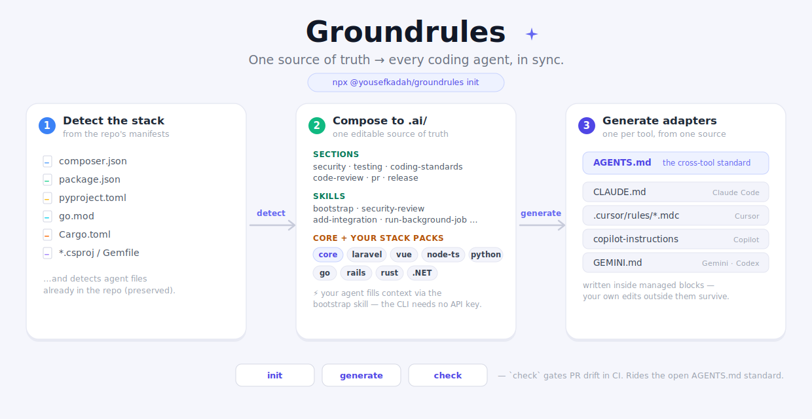

# Groundrules

**One source of truth for AI coding agents.** Detect your stack, scaffold engineering standards +
skills, and generate every tool's rules file — `AGENTS.md`, `CLAUDE.md`, Cursor, Copilot, Gemini — from
one place, kept in sync.

<p align="center">
  
</p>

> Works for **any** project. If it detects your stack (Laravel, Vue/Inertia, Node/TS, Python, Go, Rails,
> Rust, .NET), it layers in that stack's rules and recommends its tooling. If it doesn't, you still get
> the universal, security-first core.

---

## Why

Every coding agent reads a different file — `CLAUDE.md`, `AGENTS.md`, `.cursor/rules/*.mdc`,
`.github/copilot-instructions.md`, `GEMINI.md`. Maintaining them by hand means drift and duplication.
Groundrules keeps **one canonical source** (`.ai/`) and generates the rest, so your standards are written
once and every agent obeys the same rules.

It's not "another rules generator" — it's a **curated, security-first standards library** that happens
to ship with a generator. The value is the content in `packs/`, authored to staff-engineer quality and
**stress-tested on real code** (see [Battle-tested](#battle-tested)).

## Quick start

```bash
# from your project root
npx @yousefkadah/groundrules init
```

It detects your stack, writes `.ai/` + every agent's adapter, and prints stack recommendations. Then
point your coding agent at the repo and run the **`bootstrap`** skill — it scans your codebase and fills
in `.ai/context.md` + drafts project-specific skills. Edit `.ai/`, run `groundrules generate`, and every
adapter re-syncs.

> The CLI is dumb and deterministic; **your agent supplies the intelligence** (the `bootstrap` scan), so
> Groundrules never needs an API key of its own.

## Commands

| Command | Does |
|---|---|
| `groundrules init` | Detect stack, scaffold `.ai/` (core + packs), generate all adapters, print recommendations |
| `groundrules generate` | Re-generate every adapter from `.ai/` (idempotent; only managed blocks change) |
| `groundrules check` | Exit 1 if any adapter is out of sync with `.ai/` — a **CI drift gate** |
| `groundrules detect` | Print what would be detected, write nothing |

Flags: `--dry-run`, `--tools=agents,claude,cursor,copilot,gemini`, `--all`, `--cwd=PATH`.

## What it writes

```
.ai/                             # ← the canonical source you edit
  context · coding-standards · testing-policy · security-policy · code-review · pr-policy · release-policy
  skills/{bootstrap,security-review,add-integration,write-tests,add-database-change,run-background-job}/SKILL.md
AGENTS.md                        # canonical rollup (the cross-tool standard)   ┐
CLAUDE.md                        # @imports AGENTS.md                           │ generated,
.cursor/rules/groundrules.mdc    # transformed frontmatter                      │ inside managed
.github/copilot-instructions.md                                                │ markers — your
GEMINI.md                                                                       │ own edits outside
.claude/skills/*                 # skills copied for lazy-loading                │ them survive
.github/pull_request_template.md                                               ┘
```

## How composition works

Content lives in `packs/`. **Core** (universal principles) is applied first; each detected **stack pack**
adds only stack-specific detail (commands, idioms, deps) under each section. One rule decides placement:
*names a command / extension / framework API → pack; states a principle → core.*

| Pack | Fires on | Adds |
|---|---|---|
| `core` | always | security-first guardrails · testing discipline · code-review · PR hygiene · 6 skills |
| `laravel-php` | `artisan` / `laravel/framework` | Pest·PHPUnit detection, service-vs-FormRequest validation, `queue:restart`, phpstan/psalm gate — **recommends Laravel Boost** |
| `vue` | `vue` / `@inertiajs/vue3` | Vue/Inertia conventions, a11y, SSR/hydration (no TypeScript assumed) |
| `node-ts` | `tsconfig` / `typescript` | TS-strict, vitest/jest |
| `python` | `pyproject` / `manage.py` | type hints · ruff · pytest (Django/FastAPI aware) |
| `go` | `go.mod` | gofmt · error wrapping · `go test -race` |
| `rails` | `bin/rails` | RuboCop · strong params · RSpec/Minitest |
| `rust` | `Cargo.toml` | rustfmt · clippy · `Result`/`?` |
| `dotnet` | `*.csproj` / `*.sln` | nullable refs · async-all-the-way · `dotnet test` |

Adding a pack = a folder with `pack.json` + `sections/*.md` (+ optional `skills/`). Contributions welcome.

## Battle-tested

The packs aren't hand-waved. Groundrules was run on a real, production-scale Laravel + Vue app
([Monica](https://github.com/monicahq/monica)) and the generated guidance was audited by **OpenAI Codex**
*and* an independent Opus operator, over three rounds — feeding every finding back into the packs until
Codex reported **no critical or high issues remaining**. That loop caught and fixed things a generic
template ships wrong: Pest-vs-PHPUnit detection, validation that fits a service-layer app, tenant
isolation beyond queries, an instruction-trust hierarchy, webhook/OAuth hardening, and more.

## CI drift gate

Keep every agent's rules file honest — copy [`examples/groundrules-check.yml`](examples/groundrules-check.yml)
into your repo's `.github/workflows/` to fail a PR when `.ai/` changed but the adapters weren't regenerated:

```yaml
- run: npx @yousefkadah/groundrules check
```

## Rides the ecosystem — doesn't fight it

- **`AGENTS.md`** is the convergence standard (read by Codex, Cursor, Copilot, Windsurf, Gemini, Zed,
  Junie, Aider… and Claude Code). Groundrules makes it the canonical file and adapts the rest.
- **Laravel Boost** stays the authority on Laravel *facts* — the Laravel pack recommends it and defers to it.
- **Skills** use the open [`SKILL.md`](https://agentskills.io) standard.

## Roadmap

- Single Go binary via `brew` / `uvx` (engine port; the content packs are the product — `npx` already works today).
- A `--all` set of long-tail adapters (Windsurf, Cline, Junie, Aider).
- More stack packs — contributions welcome.

## Architecture

Groundrules is a small, layered codebase (zero runtime dependencies) — not one big file:

```
src/
├── cli/            controller + commands (init · generate · check · detect) + Printer
├── services/       orchestration: detection · composition · writer · body · generator · drift
├── detectors/      one StackDetector strategy per stack (Laravel, Vue, Python, Go, …)
├── strategies/     adapter render strategies (inline · @import · Cursor .mdc)
├── models/         Pack · Skill · Section · Adapter · DetectionResult · CanonicalSource
├── config/         section order + adapter registry (data, not code)
└── support/        fs · ansi · frontmatter · managed-block helpers
```

The content packs in `packs/` are the product; the engine above is deliberately thin and testable
(`node test/smoke.js`).

## Status

Working MVP — the Node engine (detect · compose · generate · check) is smoke-tested and CI-gated. The npm
package is scoped (`@yousefkadah/groundrules`) because the bare name was taken; the CLI command is still
`groundrules`.

## License

MIT © 2026 Yousef Kadah.
